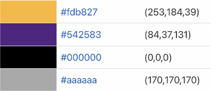

# README: project_3_group_16

This README is for Project 3 - Interactive Dashboard Visualization of the Data Bootcamp April Session.

[License](https://github.com/busen1022/project_3_group_16/blob/main/LICENSE)

## Table of contents

* [Introduction](#introduction)
* [Data Cleaning and Database Creation](#data-cleaning-and-database-creation)
* [Color Design](#color-design)
* [Website Architecture](#website-architecture)
* [Dashboard Design](#dashboard-design)
* [Research Questions](#research-questions)
* [Bias and Limitations](#bias-and-limitations)
* [Future Work](#future-work)
* [Conclusion](#conclusion)

## Introduction

The purpose of this project was to publish an interactive dashboard that visualizes rating and review data about the restaurants in Santa Barbara, CA. The data was collected from the Yelp Open Dataset available online at [Yelp Dataset](https://www.yelp.com/dataset). The dataset is open use for academic research and is available for students to learn to work with databases using sample production data.

##  Data Cleaning and Database Creation

The dataset was pared down to include only restaurants located in Santa Barbara along with geographical location, review stars, number of reviews, date of review, restaurant name, and restaurant category from [Santa_Barbara_Clean.csv](https://github.com/busen1022/project_3_group_16/blob/main/Resources/Santa_Barbara_Clean.csv) to [santa_barbara_food.sqlite](https://github.com/busen1022/project_3_group_16/blob/main/Resources/santa_barbara_food.sqlite). This was done with [Data Cleaning](https://github.com/busen1022/project_3_group_16/blob/main/Data_Cleaning.ipynb). Initial design queries were done in [queries](https://github.com/busen1022/project_3_group_16/blob/main/queries.ipynb).

* Datecolumn was formatted using pandas datetime function.  
* Dataset was filtered down to only include 10 years of data.  
* Category column was filtered down to include only 13 categories of restaurants.  

## Color Design

Ourcolor design is consistent throughout the dashboard. We chose this color palette because of our dataset’s proximity to the Los Angeles Lakers, believing our target audience would more likely be fans of the Lakers and we liked the look of the palette.

## Website Architecture

* Front-end:  
   ○ HTML (file for each tab of the website)  
   [Home](https://github.com/busen1022/project_3_group_16/blob/main/app/templates/home.html)  
   [Dashboard](https://github.com/busen1022/project_3_group_16/blob/main/app/templates/dashboard.html)  
   [Restaurants](https://github.com/busen1022/project_3_group_16/blob/main/app/templates/restaurant.html)  
   [About Us](https://github.com/busen1022/project_3_group_16/blob/main/app/templates/about_us.html)  
   [Works Cited](https://github.com/busen1022/project_3_group_16/blob/main/app/templates/works_cited.html)  
   ○ CSS  
   [CSS](https://github.com/busen1022/project_3_group_16/blob/main/app/static/static.css)  
   ○ JavaScript  
   [Dashboard](https://github.com/busen1022/project_3_group_16/blob/main/app/static/js/dashboard.js) for table and donut chart creation  
   [Leaflet-Heat](https://github.com/busen1022/project_3_group_16/blob/main/app/static/js/leaflet-heat.js) for map imports  
   [Map](https://github.com/busen1022/project_3_group_16/blob/main/app/static/js/map.js) for map creation  
   [Restaurant](https://github.com/busen1022/project_3_group_16/blob/main/app/static/js/restaurant.js) for bar chart creation  
* Back-end:  
   ○ FlaskFramework  
   [app.py](https://github.com/busen1022/project_3_group_16/blob/main/app/app.py) for app routes  
   [sqlHelper](https://github.com/busen1022/project_3_group_16/blob/main/app/sqlHelper.py) for database queries  
* Database  
   ○ SQLDatabase(SQLite)  
   [santa_barbara_food.sqlite](https://github.com/busen1022/project_3_group_16/blob/main/app/santa_barbara_food.sqlite)  

##  Dashboard Design

 An interactive dashboard was created as the core feature of the application, allowing users to filter Santa Barbara restaurants based on a 1-5 star rating on the Dashboard tab and by Restaurant Name on the Restaurants tab. The visualizations respond dynamically based on the user’s input on the dropdown filter. For the dashboard, our key design concepts were clarity, consistency, and simplicity.

* MapVisualization: The map visualization displays the locations of restaurants located in Santa Barbara. Leaflet Library was used to create marker clusters and add a heatmap layer to the map visualization.  
* DonutChart: The donut chart visualization shows the distribution of restaurant categories. The chart displays our top 5 (most reviewed) categories in the dataset. The donut chart is implemented using the 
   Plotly.js library  
* BarChart: The bar chart displays the average stars received grouped by month and also displays the count of reviews on the bar label. This allows the consumer to see any trends upward or downward affecting a      
   restaurant’s average star rating. The bar chart is implemented using the Plotly.js library.  
* DataTable: Provides detailed information about each restaurant, including name, address, category, star rating, and the number of reviews. The data table is implemented using the DataTables JavaScript library  

## Research Questions

* Where are the highly rated restaurants located?  
   ○ Our map visualization will answer this research question. After filtering the visualization to 5 stars you will notice that the majority of the five star restaurants are located in downtown Santa Barbara.

* Which categories of restaurants are highly rated?  
   ○ Our donut chart visualization will answer this research question. After filtering the visualization to 5 stars you will see that Mexican is the highest rated category with 68% of 5 star reviews.

* How does a restaurant’s average rating change month to month?  
   ○ On the Restaurants tab, the bar chart visualization can show the average review rating by month and can be filtered by restaurant so that you’re able to identify any review trends over time.

## Bias and Limitations

Limitations of this project deal with the size of the dataset selected and our approach to categories. To ensure faster load times for the website, we chose to only represent Santa Barbara. We also had multiple categories tagged for each restaurant in the dataset, which we reduced in data cleaning for better visuals. This leads to bias in the dataset through omission.

## Future Work

This project has several avenues for future work. This includes:  
* Addition of a filter for number of reviews  
* Expanding to a larger dataset (Additional cities, entire state, multiple states)  
* Addition of a custom logo  
* Improved code organization  

## Conclusion

In conclusion, we found most Santa Barbara yelpers like Mexican food best and that their best chance of finding restaurants is in the downtown area. We also found that average stars over-all is consistent at 4 stars, but can vary wildly restaurant to restaurant.